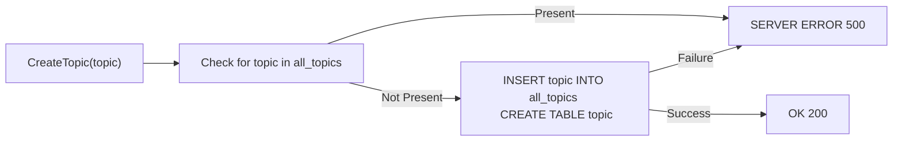
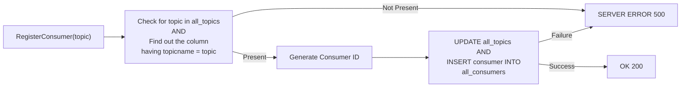
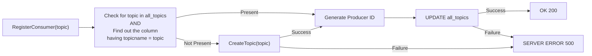
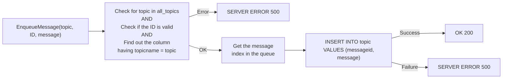
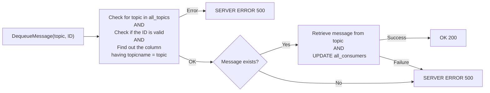
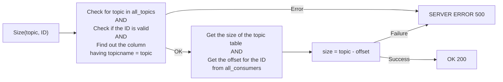

# Persistence and Database Design
Persistent Storage is implemented in the form of a `postgreSQL` database. The database consists of two global tables, namely `all_topics` and `all_consumers` . Aside from these tables, each topic has its separate table (with the same name as the topic) in the database to store the topic-specific queue. 

**Topic Names**
Topic Names are limited to 255 characters, because of the low probability of larger names. 
Topic Names are **NOT** case sensitive, because we believe that not much difference can be added by adding case specificities. Essentially, `hello_world` and `HELLO_WORLD` are the same thing.

**Consumer and Producer IDs**
While creating a new consumer (or a producer), the number of consumers already there for this topic is found out from the `consumers` (or `producers`) column of that topic in the `all_topics` table. This with the `topicid` and a flag (0 for consumers and 1 for producers) allows us to create an ID which uniquely identifies every entity in the system.  Consumer and producer IDs can range from 10 to 28 digits.
|Number of consumers for this topic | Topic ID | Flag |
| --- | --- | --- |
|Upto 18 digits | Upto 9 digits | 1 digit 

### Design of the Distributed Queue
Each topic-specific distributed queue is implemented as a append-only table, having the same name as the topic. New messages will be added to the distributed queue by the producers who have subscribed to/created these topics, these will be appended to the tail of the queue. 
When a new consumer subscribes to a topic, they will see all the messages in the queue (i.e. all rows in the distributed table), the number of messages a consumer can see is determined by how many messages they have consumed already. This is stored in the `all_consumers` table. Each topic-specific distributed queue contains:
|Column Name | Function|
| :---: | :--- |
|`messageid` | ID to uniquely identify each message|   
|`message` | Message text|   

### The `all_topics` table
It is the responsibility of the `all_topics` table to keep track of all topics in the distributed queue. All the information about the topic such as the number of consumers and producers signed up and the number of rows in the distributed queue filled are kept in this table. The topic name is kept as the primary key. Each row of the `all_topics` table contains:
|Column Name | Function|
| :---: | :--- |
|`topicname` | The name of the topic, serves as the primary key for all search purposes|   
|`topicid` | A unique ID for each topic, used to generate the consumer and producer IDs|      
|`consumers`|The number of consumers subscribed to this topic, used to generate the consumer ID|
|`producers`|The number of producers subscribed to this topic, used to generate the producer ID|
|`tailid`|The number of messages in the queue of the topic since topic creation|

It needs to be noted that the values stored in the `consumers` and the `producers` columns are different from the IDs used to uniquely identify each topic-specific consumer and producer.

### The `all_consumers` table
The `all_consumers` table is used to find the start index of a particular consumer in the message queue for a particular topic. This table maps a consumer ID (this identifies each topic-specific consumer separately) to the index of the next message for this consumer in its topic-specific queue.
|Column Name | Function|
| :---: | :--- |
|`consumerid` | Topic-specific consumer ID|   
|`queueoffset` | The `messageid` of the next message for this consumer in the queue|   

# Database Access
The following sections show how the Python functions simulating request endpoints interact with the database. All these methods first check if the request adheres to the format specified in the problem statement. If they don't, a `BAD REQUEST (400)` response is sent back. We present these flowcharts considering that the request format is valid. 

### `CreateTopic(): /topics POST`

### `ListTopics(): /topics GET`
This function simply fetches all values in the `topicname` column of the `all_topics` table and returns a list of all topics.

### `RegisterConsumer(): /consumer/register POST`

This method returns the unique consumer ID generated according to the scheme mentioned above. It can be seen that the number of queries are minimized.

### `RegisterProducer(): /producer/register POST`

This method is similar to the consumer registration, except the fact that if some topic is not already present, it will be created by calling the `CreateTopic()` routine.

### `EnqueueMessage(): /producer/produce POST`
Like earlier methods, the format of the request is checked first. We need three parameters, namely producer ID, topic name and the message text. 
To check if the ID given is valid, we separate the flag, topic ID and producer number parts and individually check them from the `all_topics` table.

### `DequeueMessage(): /consumer/consume GET`
The dequeue operation is similar to the enqueue operation, except the fact that no message is actually removed from the topic specific queue. This is because of our choice to allow a new consumer to see all the messages in the topic-specific queue. 
 

### `Size(): /size GET`

